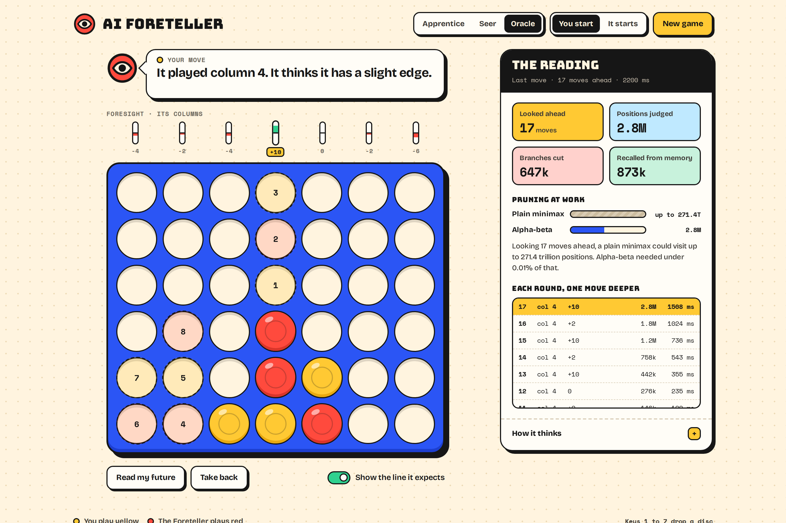
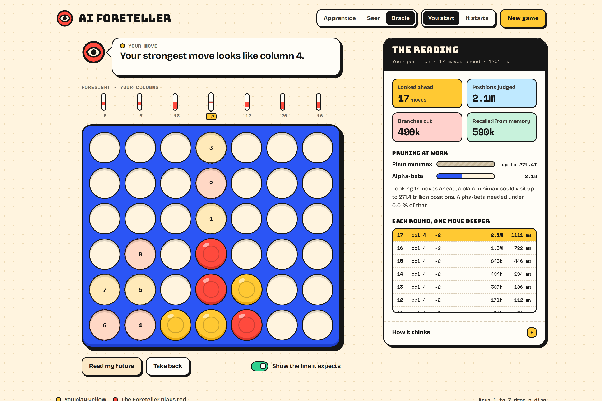
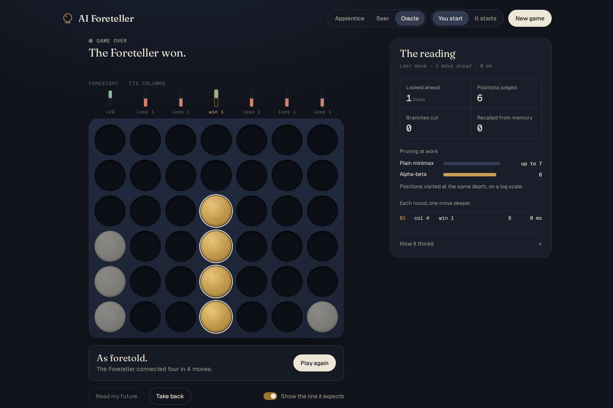
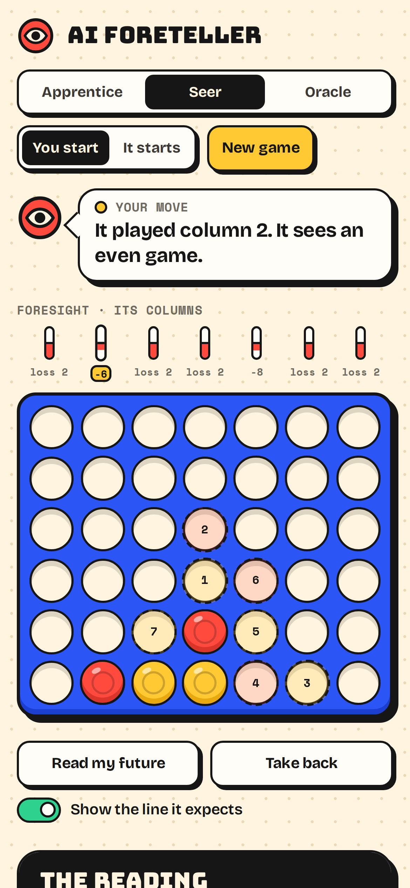
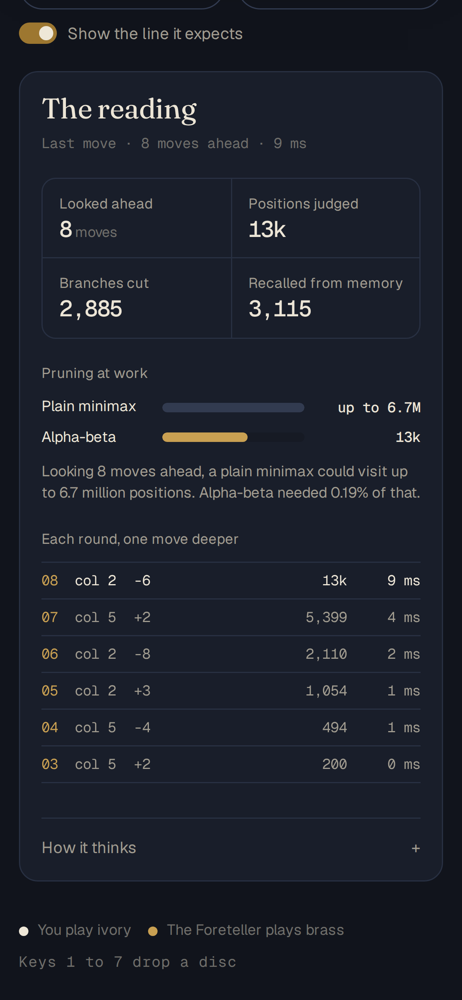

<div align="center">

# AI Foreteller

**Connect Four against an AI that shows you what it sees.**

Every column scored, the line of play it expects drawn on the board,
and a live count of how much of the game tree alpha-beta pruning skipped.

**[Play it](https://ai-foreteller.vercel.app)**



</div>

## What it does

- **Three levels.** Apprentice looks 2 moves ahead and sometimes picks a slightly weaker move.
  Seer looks 8 moves ahead. Oracle searches as deep as it can in about two seconds: around 15 moves from the opening on a laptop, and deeper as the board fills.
- **Foresight row.** After each move, a bar above every column shows how good that column was for the AI:
  a score, or "win 3" / "loss 2" once it can see the game to the end.
- **The line it expects.** Numbered dashed discs on the board show the next 8 moves it thinks both of you will play.
- **Read my future.** Runs the same search for your side and shows your strongest column.
- **The reading.** Positions judged, branches cut, positions recalled from memory, and each round of the
  search as it finishes, so you can watch it look one move deeper at a time.
- **Pruning at work.** Compares the positions it visited with what a plain minimax could need at the same depth.
- Take back a move, choose who starts, keys 1 to 7 to drop a disc, and a layout that works on phones.
- **Look.** The classic red and yellow on a cobalt board, drawn like a sticker sheet: thick outlines, hard shadows, and a Foreteller that speaks in a bubble and glances around while it thinks. Type is Bungee, Bricolage Grotesque and Space Mono.

## How the AI works

All of it is in [`js/engine.js`](js/engine.js), about 380 lines with no libraries.

| Technique | What it does here |
| --- | --- |
| Negamax with alpha-beta pruning | Minimax written from the side to move's point of view. A branch is dropped as soon as it is proven worse than a move already found. |
| Iterative deepening | Searches 1 move ahead, then 2, then 3, until the time or depth limit. Each round's best move is tried first in the next, which makes pruning far more effective. |
| Move ordering | Centre columns first, and the best move remembered for a position before anything else. |
| Transposition table | Zobrist hashing of the board into a table of about a million entries, so a position reached by a different move order is looked up instead of searched again. Deeper results from the current search are protected from being overwritten. |
| Win detection | Checks only the lines through the new disc, and wins in one move are found before searching further. |
| Evaluation | When the end is out of sight, each of the 69 possible lines of four is scored by how many discs one player has in it with the other player's absent, plus a bonus for the centre column. |
| Win distance | A win found k moves ahead scores higher the smaller k is, so it takes the fastest win and, when losing, holds out longest. |
| Web Worker | The search runs off the main thread, so the page keeps animating while it thinks. Opened from a file, it falls back to searching on the page. |

Looking 8 moves ahead from the opening, a plain minimax could visit about 6.7 million positions.
Alpha-beta with this move ordering visits around 27 thousand.

## Screenshots

| Reading your future | The Foreteller wins |
| --- | --- |
|  |  |

| Phone | The reading on a phone |
| --- | --- |
|  |  |

## Run it

It is a static site with no build step.

```bash
npx serve .      # then open the address it prints
npm test         # engine tests, Node 20 or newer
```

Opening `index.html` straight from the file system also works; the search then runs on the page
instead of in a worker.

## Tests

[`test/engine.test.js`](test/engine.test.js) uses Node's built-in test runner and checks:

- wins in all four directions, and the four cells returned for the highlight
- that undo restores the board and its hash, and that one position reached in two orders hashes the same
- that it takes a win in one, blocks a threat, and finds a forced win through a double threat
- that iterative deepening reports each depth in order and stops on time
- that pruning visits under 1% of what plain minimax would at depth 8
- that the expected line is always legal and as long as the search depth
- that it never loses to a random player

## Project structure

```
index.html            Page
styles.css            Layout and theme
js/engine.js          Board, evaluation and search (also loaded by the worker and the tests)
js/worker.js          Runs the search in a Web Worker
js/app.js             Turns, board rendering and the reading panel
test/engine.test.js   Engine tests
```

## Author

**Minahil Nadeem** · [GitHub](https://github.com/minahilnadeem6688) · [LinkedIn](https://www.linkedin.com/in/minahil-nadeem23)

## License

[MIT](LICENSE)
